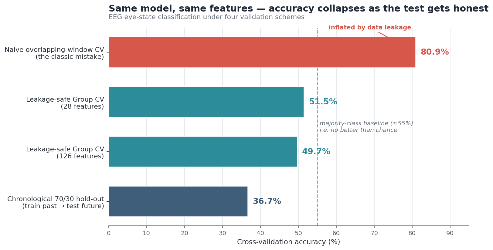
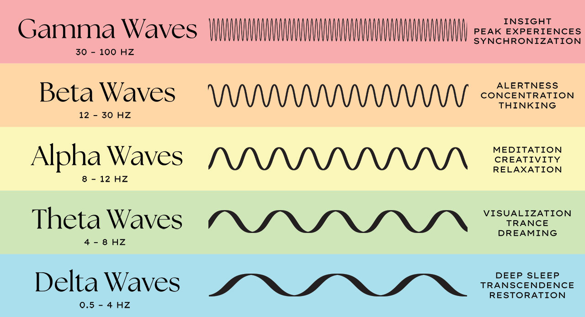
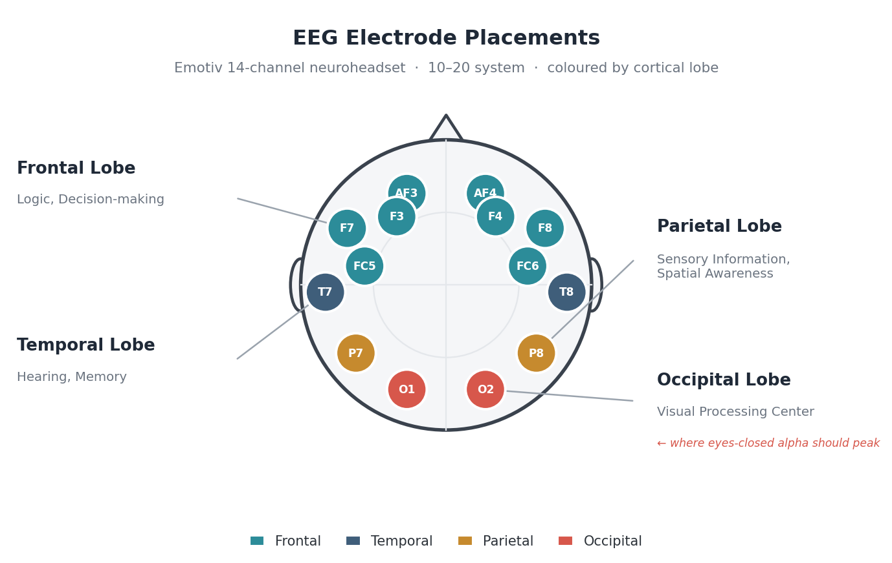

<div align="center">

# 🧠 EEG Eye-State Validation
### A healthcare-analytics case study in *trusting your metrics*

**A model that looked `81%` accurate turned out to be no better than a coin flip — and proving that, rigorously, is the entire point.**

<br>


-D7574B)

<br>

<!-- 👇 Replace YOUR-USERNAME below (and `main` with `master` if that's your default branch) -->
<a href="https://colab.research.google.com/github/YOUR-USERNAME/eeg-eye-state-validation/blob/main/notebook/eeg_eye_state_analysis.ipynb">
  
</a>
&nbsp;
<a href="https://nbviewer.org/github/YOUR-USERNAME/eeg-eye-state-validation/blob/main/notebook/eeg_eye_state_analysis.ipynb">
  
</a>

</div>

<br>

<div align="center">
  
</div>

> ### 🧭 TL;DR
> The same Random Forest, on the same features, scored **81% → 51% → 37%** depending on *one thing only:* **how honestly it was tested.** This repo is a worked example of catching that — leakage-aware splits, baseline-anchored benchmarking, effect sizes, a permutation test, and an honest write-up of a **null result**. That discipline is the part that transfers straight into clinical and health-data analytics.

---

## 📋 Contents

- [🔬 Overview](#overview)
- [🧠 Background: the signals and the sensors](#background-the-signals-and-the-sensors)
- [🏥 Why a healthcare analyst should care](#why-a-healthcare-analyst-should-care)
- [📊 The headline finding](#the-headline-finding)
- [⚙️ How it works](#how-it-works)
- [🔎 Results in detail](#results-in-detail)
- [🗂️ Repository structure](#repository-structure)
- [🚀 How to run it](#how-to-run-it)
- [⚠️ Limitations and next steps](#limitations-and-next-steps)
- [ℹ️ About this project](#about-this-project)

---

## Overview

The surface question is deliberately small: **can a model tell whether a person's eyes are open or closed from their raw EEG?** A naively-built pipeline said *yes, ~81% of the time*. After auditing **where that number came from**, the real, leakage-free accuracy was **~51%** — the same as always guessing the more common answer.

This repository documents that gap and treats it as the main finding:

> **A metric is only as trustworthy as the test that produced it.**

---

## Background: the signals and the sensors

Two pieces of domain context make the rest of the project readable.

<p align="center">
  <br>
  <sub><i>EEG splits into frequency bands. This project's features are built mainly on <b>Alpha (8–12 Hz)</b> and <b>Beta (12–30 Hz)</b> power, with Delta / Theta / Gamma added in the expanded feature set.</i></sub>
</p>

<p align="center">
  <br>
  <sub><i>The Emotiv 14-channel layout (10–20 system) used to record this dataset, coloured by cortical lobe. The occipital sites <b>O1 / O2</b> sit over the visual cortex — exactly where the eyes-open vs. eyes-closed "Berger effect" should be strongest.</i></sub>
</p>

---

## Why a healthcare analyst should care

The dataset is public and the headline result is a *negative* one — but the skill on display is the one that matters most in clinical and health-data analytics: **separating a real signal from an artifact, and refusing to trust a number until it survives a fair test.**

| 🧪 Demonstrated here | 🏥 The same thing, in healthcare analytics |
|---|---|
| **Leakage-aware validation** (grouping correlated records) | Stopping future / duplicate patient data from leaking into training |
| **Baseline-anchored benchmarking** (vs. a majority-class dummy) | Asking *"does this beat current practice / standard of care?"* |
| **Effect sizes & significance** (Cohen's *d*, permutation test) | Telling a real, meaningful difference apart from noise |
| **Handling non-stationarity** (chronological hold-out) | Knowing a model can validate on the past yet fail on a new period/population |
| **Honest reporting of a null result** | Communicating what the data *actually* supports, to any audience |

> 💡 *This is a methods demonstration on a public EEG dataset — not clinical or patient data. The value is the validation discipline, which carries directly into healthcare analytics.*

---

## The headline finding

The **same model and the same features**, scored five different ways:

| Validation method | Accuracy | Baseline | Verdict |
|---|:---:|:---:|---|
| 🟥 Naive overlapping-window CV | **80.9%** | — | Inflated — **data leakage** |
| 🟦 Leakage-safe Group K-Fold (28 features) | **51.5% ± 2.6%** | ~55% | At chance |
| 🟦 Leakage-safe Group K-Fold (126 features) | **49.7% ± 4.5%** | ~55% | No gain — **signal ceiling**, not feature poverty |
| 🟦 Chronological 70 / 30 hold-out | **36.7%** | 22.3% | +14.4 pts, but exposes **non-stationarity** |
| 🧪 Label-permutation test (N = 200) | **p = 0.50** | — | Statistically **indistinguishable from chance** |

**The pattern *is* the story:** as the test gets fairer, the apparent skill disappears. The famous high accuracies this dataset is known for are largely a product of how loosely the model is validated.

---

## How it works

<details>
<summary><b>📥 The data</b> (click to expand)</summary>

<br>

- **Source:** UCI Machine Learning Repository — *EEG Eye State* dataset.
- **Device:** Emotiv EPOC, 14-channel consumer EEG headset.
- **Recording:** one subject, ~117 seconds, sampled at **128 Hz** → **14,980 rows**.
- **Label:** `eyeDetection` — `0` = open, `1` = closed (derived from synchronized video).
- **Class balance:** 55.1% open / 44.9% closed (mild imbalance).

The physiology being tested is the **Berger effect**: closing the eyes should boost the alpha rhythm (8–12 Hz), most strongly over the occipital (visual) cortex.

</details>

<details>
<summary><b>🧹 Cleaning &amp; preprocessing</b></summary>

<br>

1. **Quality control.** No missing values. A sensor-range check flagged physiologically impossible spikes (one channel jumping while its neighbour stays calm); rows with any channel outside 2,000–10,000 µV were dropped as electrode-contact glitches — **4 rows (0.03%)**.
2. **Band-pass filter.** 1–40 Hz, 5th-order Butterworth, zero-phase (`filtfilt`). The 1 Hz high-pass kills slow drift and the DC jump at eye transitions; the 40 Hz low-pass suppresses line noise and EMG.

</details>

<details>
<summary><b>🧮 Feature extraction &amp; modelling</b></summary>

<br>

- **Features:** Welch's method over sliding **2-second windows** (256 samples, step 32).
  - *Baseline:* Alpha + Beta power per channel → **28 features**.
  - *Expanded:* + Delta/Theta/Gamma, Alpha/Beta ratio, per-window variance, Hjorth mobility & complexity → **126 features**.
- **Model:** Random Forest, evaluated under **Stratified Group K-Fold** (windows grouped into 1,024-sample time-blocks so overlapping near-duplicates never straddle the split — *this is the fix for the leakage*), plus a **chronological hold-out**, a **permutation test**, **Cohen's *d***, and a confusion matrix.

</details>

---

## Results in detail

<details>
<summary><b>🔎 Full results breakdown</b> (click to expand)</summary>

<br>

- **Cleaning:** 14,980 → 14,976 samples (0.03% removed); 0 missing.
- **Filtering:** processed signal re-centres on ~0 µV; the artificial baseline jump at eye closure vanishes.
- **Condition comparison:** Alpha/Beta band-power distributions **overlap heavily** — no clean separation.
- **Berger effect:** eyes-closed alpha only mildly boosted (closed/open 1.0–1.2×) and **not** dominated by occipital sites (O1/O2 only 1.00–1.05×) — consistent with the headset's limited posterior coverage.
- **Time-resolved view:** eye state arrives in long contiguous blocks; mean rolling occipital alpha is virtually identical open (1.360) vs closed (1.384).
- **Effect sizes:** largest alpha-power Cohen's *d* = **0.422**; most channels negligible (|d| < 0.2), occipital near 0.
- **Significance:** permutation test **p = 0.50** (true 0.5154 vs permuted 0.5159 ± 0.025). The confusion matrix shows the model defaulting to "open".

📄 Full write-up: [`reports/analysis_report.md`](reports/analysis_report.md)

</details>

---

## Repository structure

```
eeg-eye-state-validation/
├── README.md                         ← you are here
├── requirements.txt                  ← dependencies
├── LICENSE                           ← MIT
├── .gitignore
├── data/
│   └── EEG_Eye_State.arff            ← the dataset (or link to UCI)
├── notebook/
│   └── eeg_eye_state_analysis.ipynb  ← the full, runnable analysis
└── reports/
    ├── analysis_report.md            ← standalone written report
    └── figures/
        ├── validation_comparison.png ← the hero chart above
        ├── brainwave_bands.jpg       ← EEG frequency-band reference
        └── eeg_electrode_placements.png  ← sensor-layout reference
```

---

## How to run it

> ⚡ **Easiest:** click the **Open in Colab** badge at the top — it runs in your browser, nothing to install.

Or run locally:

```bash
# 1. Clone
git clone https://github.com/YOUR-USERNAME/eeg-eye-state-validation.git
cd eeg-eye-state-validation

# 2. (Optional) create a virtual environment
python -m venv .venv && source .venv/bin/activate     # Windows: .venv\Scripts\activate

# 3. Install dependencies
pip install -r requirements.txt

# 4. Launch the notebook
jupyter notebook notebook/eeg_eye_state_analysis.ipynb
```

> ✅ The notebook loads the data via a **relative path** (`../data/EEG_Eye_State.arff`), so it works as soon as you clone — no path editing needed.

---

## Limitations and next steps

<details>
<summary><b>⚠️ Honest limitations</b></summary>

<br>

- **Single subject** — may not generalise to other people or sessions.
- **Feature scope** — spectral/complexity features only; no connectivity or learned temporal dynamics.
- **Window overlap** — grouping handles the leakage, but leaves only ~15 genuinely independent time-blocks.
- **Non-stationarity** — eye state comes in long blocks, so chronological splits get very different train/test label mixes.
- **Artifacts** — ocular/EMG contamination only partly suppressed by a 1–40 Hz filter (no ICA).
- **Crude outlier rule** — a fixed amplitude threshold can miss subtle artifacts or discard valid extremes.

</details>

<details>
<summary><b>🚀 Where I'd take it next</b></summary>

<br>

- Report subject-/block-wise CV **alongside** a chronological hold-out, a dummy baseline, and a permutation test — as standard.
- Apply **ICA-based artifact removal** to separate true neural alpha from ocular/EMG.
- Bring in **learned temporal models** (temporal CNNs / LSTMs) and connectivity features.
- **Validate on multi-subject data** to test cross-person generalisation.

</details>

---

## About this project

This is a portfolio piece demonstrating **rigorous, leakage-aware analysis of real physiological data**. The dataset is public and the result is a documented null finding — the value is in the **validation methodology** and the honest reporting of it.

**Author:** Loknadh Kona
**Dataset citation:** Roesler, O. (2013). *EEG Eye State* [Dataset]. UCI Machine Learning Repository. <https://archive.ics.uci.edu/dataset/264/eeg+eye+state>

<div align="center">
<br>
<i>⭐ If the "trust your validation, not your accuracy" lesson resonated, feel free to star the repo.</i>
</div>
